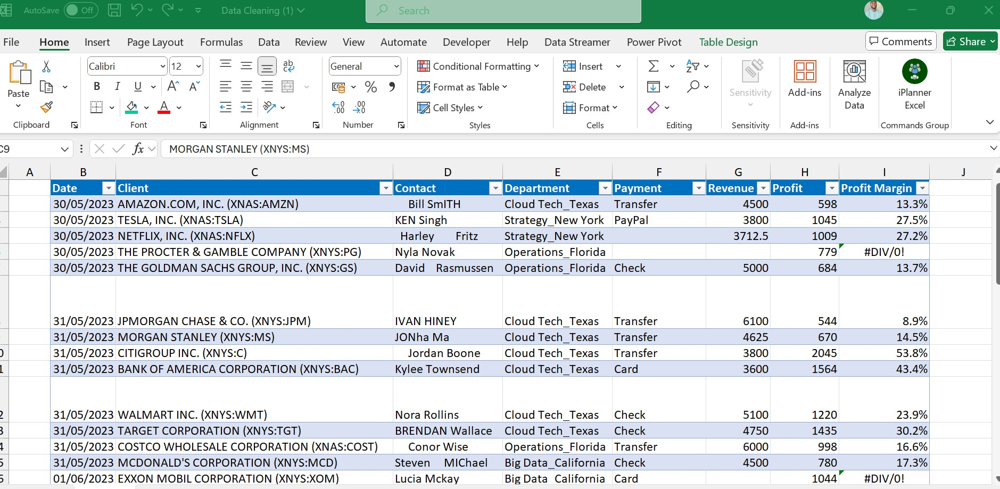
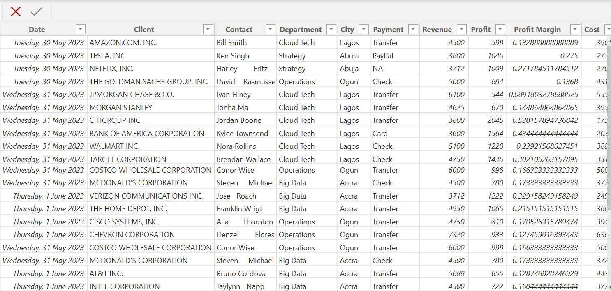
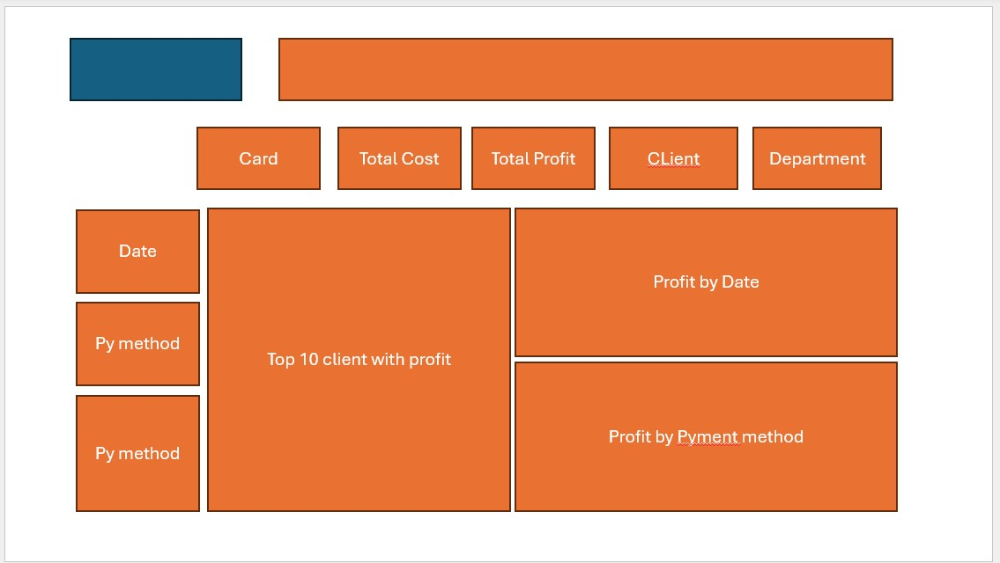
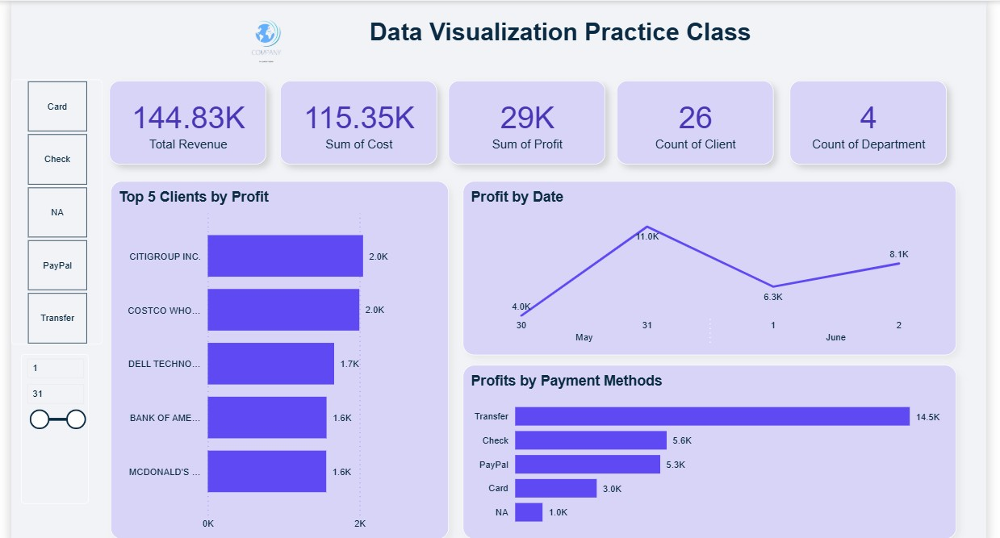

# MUBARAK Enterprise Revenue Analysis & Visualization
## Introduction
This project focuses on analyzing and visualizing the revenue generation data of MUBARAK Enterprise to uncover key insights, trends, and opportunities for growth.

## Problem Statement
Using business data, interactive dashboards and visualizations will be created to answer critical questions such as:
 Which payment method generate most revenue
1.  Revenue trend by period
2.  Top 5 clients with highest revenue
3.  Countries and their revenue generation
4.  What is cost, revenue and profit in total
5.  Which payment method generate most revenue

The goal is to provide actionable recommendations to optimize revenue streams and support data-driven decision-making for MUBARAK Enterprise.

## Skills & Expertise Employed/Gained in the Analysis Process
-  Data Cleaning & Preparation – Handling missing values, and formatting inconsistencies in MUBARAK Enterprise’s revenue data.
-  Data Analysis – Using statistical methods and business intelligence techniques to identify trends, patterns, and key revenue drivers.
-  Data Visualization – Creating charts (bar, line, pie, etc.), dashboards, and KPIs for clear insights using tools like Excel, Power BI
-  Financial Analysis – Evaluating revenue streams, profitability, and growth opportunities.
-  Report Writing & Presentation – Summarizing findings and recommendations in a structured, professional format.

These skills ensured a thorough and insightful analysis of MUBARAK Enterprise’s revenue performance.

## Data Modelling

Data in Excel             |     Data in Power BI     |  My Dashboard sktech
:---------------------:   | :---------------------:  | :---------------------:
        |      |   

## Visualization

Dashboard    |     
:---------------------:   
       

## Analysis : Key Revenue Insights - MUBARAK Enterprise
-  Financial Overview:
Revenue: ₦144.83K | Cost: ₦115.35K | Profit: ₦29K (20% margin)
-  Top-Performing Clients:
Citigroup (Highest revenue generator)
Costco & Dell Technology (Next top contributors)
-  Payment Method Analysis:
Transfer dominated revenue (₦15K), 3x higher than card/check payments.
Citigroup & Costco drove 100% of transfer-based revenue.
-  Monthly Peak
May recorded the highest revenue (₦11K).
-  Data Gap:
Netflix contributed ₦3.71K, but payment method was unclassified (potential tracking issue).
Strategic Note:
Client & payment trends suggest transfer-based clients (Citigroup/Costco) are key profit drivers

## Recommendations & Conclusions
### Key Takeaways:
-  Revenue Optimization: Focus on high-value clients (Citigroup, Costco, Dell) and replicate their success strategies.
-  Payment Efficiency: Transfer method drives 3x more revenue than cards/checks—encourage more clients to adopt it.
-  Cost Control: With a 20% profit margin, review expenses to further boost profitability.
-  Data Quality: Missing payment method for Netflix (₦3.71K) suggests a need for better transaction tracking.
### Strategic Actions:
-  Upsell transfer payments to other clients to maximize revenue.
-  Analyze May’s peak performance to replicate success in other months.
-  Improve data collection to eliminate gaps in payment records.

## Final Thought: 
MUBARAK Enterprise has strong revenue streams, but refining client focus, payment methods, and data processes can enhance profitability further.

